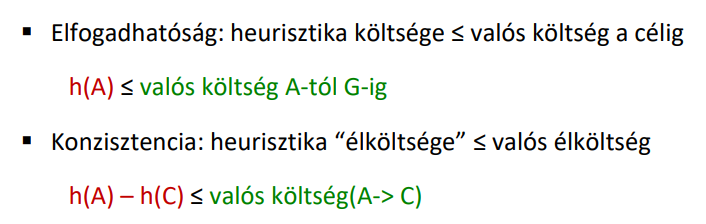
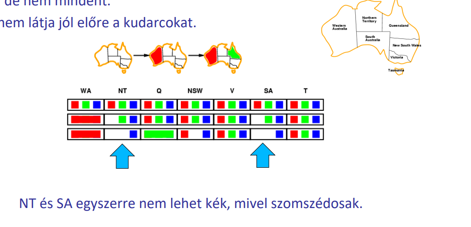
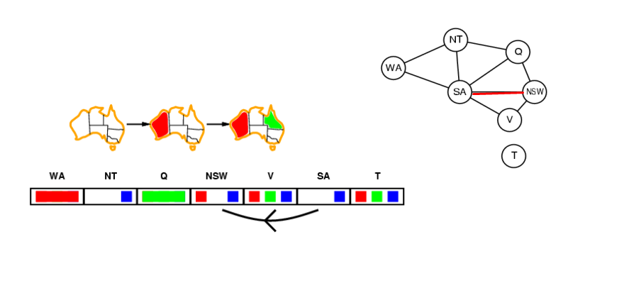
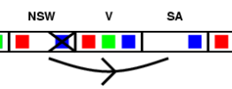
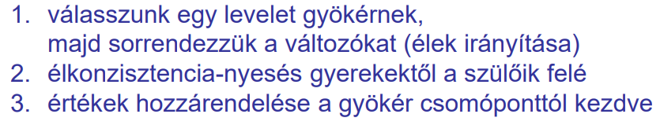
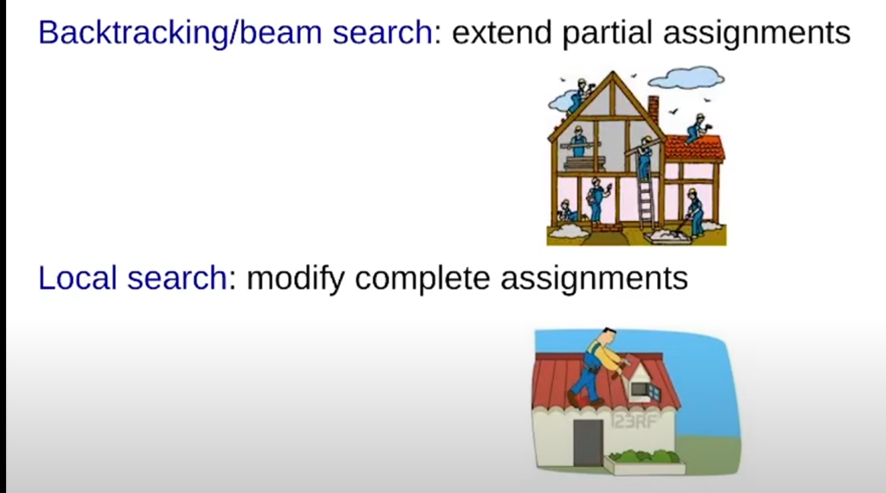
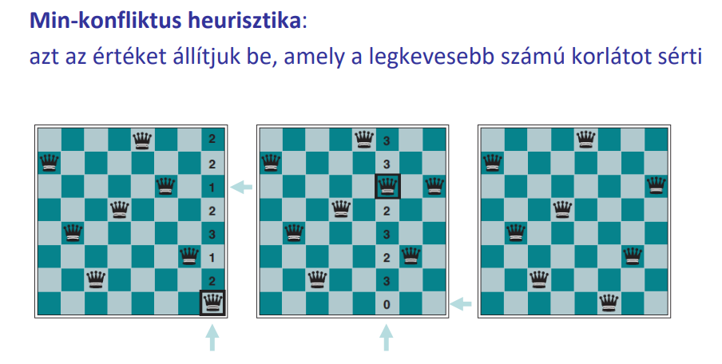

# heurisztika optimalitása
    egy heurisztika nem csak elfogadhato kell hogy legyen hanem
    konzisztens is:
 ### konzisztencia

    A heurisztikus érték (ℎ(𝐴)h(A)) nem haladhatja meg a valódi költséget a kezdőponttól a célig. Azaz:

    A heurisztika "előrelépése", vagyis a különbség két csomópont heurisztikái között, soha nem lehet nagyobb, mint a két csomópont közötti valódi élköltség.

# kényszerkielégítési problémák (CSP)

    cél megtalálása és a **kényszer betartása**
    pl n-queen problem, térképszínezés de irl egy szállítás-
    üzemezés és egy órarendtervezés is ilyen

    váltok alapján lehet:

    -	diszkrét változók -> véges és végtelen értéktartomány
    -	folytonos változók -> fizikai állapotváltozók

    kényszerek alapján:

    -	unáris kényszer: egyetelen változóra vonatkozik
    -	bináris kényszer: két változó viszonyára
    -	magasabb-rendű kényszer: 3 vagy több változó viszonya
    -	preferencia-kényszer 

## kényszergráf
    csomópontjai a változók és élei a bináris kényszerek
    pl holtpont detekciónál volt opréból
    csak bináris csomópontok (egy kényszer-> max 2 változó)

# visszalépéses informálatlan keresés

    a változóhozzárendelés kommutatív, egy csomópont pedig csak 
    egy hozzárendelés lehet
    nem informált keresésnél hasznos
    mélységi keresés, ami kényszersértésnél visszalép

# visszalépéses keresés hatékonyságnövelés

### Előretekintő ellenőrzés: Ki tudjuk korán szűrni a kudarcra ítélt megoldásokat? 

    mindig amikor Xnek értéket ad megvizsgál egy Xhez 
    kényszerrel kapcsolt lekötetlen Yt és törli Y tartományából
    az X számára választott értékkel inkonzisztenseket

    Ez sok inkonzisztenciát észrevesz, de nem  mindet és nem látja előre a kudarcokat

#### Élkonzisztencia
    X → Y él konzisztens, ha minden x értékhez van LEGALÁBB EGY megfelelő y érték, amely megengedi az él menti kényszer teljesülését.

    Élkonzisztencia terjesztése (AC-3): Hasznos előfeldolgozó lépés keresés előtt
    Működése: minden élre biztosítjuk az élkonzisztenciát.

    Ha X tartományából törlünk egy értéket X szomszédait újra ellenőrizzük.

### Sorrendezéssel is növeéhetjük a hatékonyságot

- Legkevesebb fennmaradó érték (MRV):
    a legkisebb számú megengedett értékkel rendelkező változóval kezdjünk, ill. folytassunk
    választjuk

- Fokszám heurisztika:
    maximális fokszámút választjuk, ez csökkenti a későbbi választások elágazási tényezőjét

- Legkevésbé korlátizó érték:
    A legkevesebb választást kizárót választjuk

### CSP struktúrák

-   CSP gráf: független komponensek lehetnek
-   CSP fa gráf: változószámban lineáris -> könnyű megoldás

# CSP lokális kereséssel
Alapötlet: nem az alapoktól építünk fel egy megoldást, random csinálunk egyet és azt módosíjuk.

